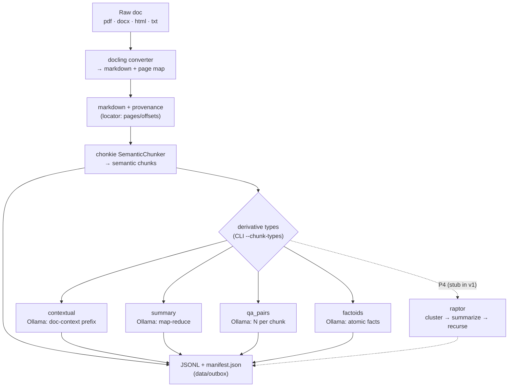
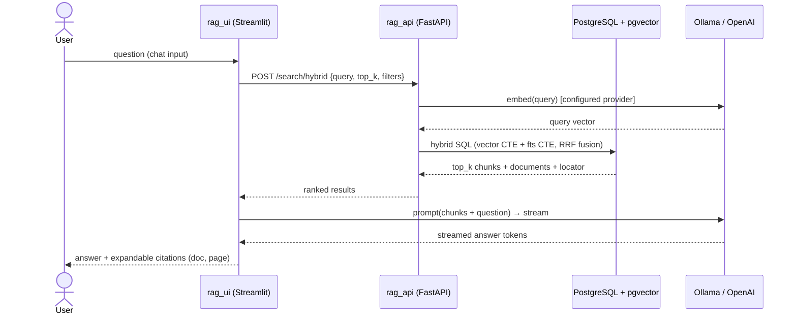
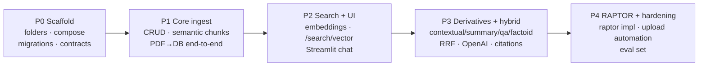

# Enterprise RAG Platform — High-Level Design

**Version**: 1.0 · **Date**: 2026-09-06 · **Status**: Draft for review

## 1. Purpose & Scope

An on-prem-first, enterprise-grade RAG (Retrieval-Augmented Generation) platform for searching internal documents (PDF, DOCX, HTML, TXT), including very long multi-page documents. The system converts documents into multiple derivative artifact types — semantic chunks, contextual chunks, abstractive summaries, QA pairs, factoids, and (later) RAPTOR trees — stores them with full source lineage in PostgreSQL/pgvector, and serves hybrid search + LLM answers through a Streamlit UI.

The solution is organized as **four independently deployable projects**, each in its own folder, so it can be built and shipped in parts.

**Key constraints**: no SQLAlchemy (raw SQL via psycopg v3) · no auth in v1 · target corpus < 1,000 documents · Docker Compose deployment.

## 2. System Architecture

```mermaid
flowchart LR
    subgraph P1["Project 1: chunker"]
        direction TB
        RAW["Raw documents<br/>PDF · DOCX · HTML · TXT"]
        CONVERT["docling conversion<br/>markdown + provenance"]
        SEMANTIC["chonkie semantic chunks"]
        DERIVATIVES["Ollama derivatives<br/>contextual · summary · QA · factoid"]
        OUTBOX["JSONL + manifest<br/>data/outbox"]

        RAW --> CONVERT
        CONVERT --> SEMANTIC
        SEMANTIC --> DERIVATIVES
        SEMANTIC --> OUTBOX
        DERIVATIVES --> OUTBOX
    end

    subgraph P2["Project 2: ingest_client"]
        direction TB
        READ["Read and validate JSONL"]
        STATE["Idempotency + resume state"]
        BATCH["Batch document and chunk requests"]

        READ --> STATE
        STATE --> BATCH
    end

    subgraph P3["Project 3: rag_api"]
        direction TB
        CRUD["FastAPI CRUD<br/>documents · chunks · collections"]
        SEARCH["Vector + hybrid search<br/>pgvector + full-text RRF"]
        DB[("PostgreSQL 16 + pgvector<br/>documents · chunks · indexes")]

        CRUD --> DB
        SEARCH --> DB
    end

    subgraph P4["Project 4: rag_ui"]
        direction TB
        CHAT["Streamlit chat controls"]
        RETRIEVE["Search results + citations"]
        ANSWER["Streamed grounded answer"]

        CHAT --> RETRIEVE
        RETRIEVE --> ANSWER
    end

    OLLAMA["Ollama<br/>embeddings + LLM generation"]
    OPENAI["OpenAI API<br/>optional provider"]

    OUTBOX -->|"Flow 1: JSONL + manifest"| READ
    BATCH -->|"Flow 2: PUT /documents<br/>POST /chunks/bulk"| CRUD
    CHAT -->|"Flow 3: POST /search/vector or /search/hybrid"| SEARCH
    SEARCH -->|"Flow 4: ranked chunks + provenance"| RETRIEVE
    DERIVATIVES -.->|"generation"| OLLAMA
    SEARCH -.->|"query embedding"| OLLAMA
    ANSWER -.->|"grounded answer stream"| OLLAMA
    SEARCH -.->|"optional embeddings"| OPENAI
    ANSWER -.->|"optional answer stream"| OPENAI
```



**Design principles**
- **Single API service**: one FastAPI app owns all DB access and search; everything else is a client of it.
- **File-based handoff between ingestion and serving**: the chunker never touches the DB directly; it writes a versioned JSONL contract that `ingest_client` pushes through the API. This keeps projects decoupled and independently testable.
- **Lineage is non-negotiable**: every vector record traces back to a source document and a page/offset locator, and derivative artifacts trace to their parent chunk.
- **Provider-agnostic AI**: embeddings and LLM generation are configurable between Ollama (on-prem default) and OpenAI via environment settings.

### 2.1 Technology Stack Summary

| Area | Technology | Role | Relevant implementation details |
|---|---|---|---|
| Runtime | Python 3.12+ | Common language for all four projects | Each project is independently runnable with its own dependencies; shared Pydantic contracts define the JSONL and API payloads. |
| Document conversion | Docling | Converts PDF, DOCX, and HTML to Markdown | Preserves document metadata and page-level provenance for the `chunks.locator` lineage field; TXT is passed through. |
| Chunking | Chonkie `SemanticChunker` | Creates retrieval-ready semantic chunks | Embedding-aware boundaries; chunk size and overlap are configured with `CHUNK_SIZE` and `CHUNK_OVERLAP`. |
| Derivative generation | Ollama | Produces contextual prefixes, summaries, QA pairs, and factoids | On-prem default; model is configurable, for example `llama3.1`, `gemma3`, or `qwen3`. RAPTOR is introduced in P4. |
| Embeddings | Ollama or OpenAI API | Generates document and query vectors | Fixed per deployment: bge-m3 (1024), nomic-embed-text (768), or OpenAI `text-embedding-3-small` (1536). Re-embed all data when the dimension changes. |
| API | FastAPI | Owns persistence, ingestion endpoints, and search | Uses Pydantic request/response DTOs; exposes CRUD plus `/search/vector`, `/search/hybrid`, `/health`, and `/ready`. |
| Database access | psycopg v3 + `psycopg_pool` | Executes database operations from `rag_api` | Raw SQL only; SQLAlchemy is explicitly out of scope. |
| Database | PostgreSQL 16 + pgvector | Stores documents, chunks, artifacts, lineage, and vectors | HNSW cosine index for vector search; generated `tsvector` with GIN index for full-text search; RRF fuses both rankings. |
| UI | Streamlit | Provides the internal chat and citation experience | Uses `st.chat_input`, `st.chat_message`, session-state history, and `st.write_stream` for answers. |
| Deployment | Docker Compose | Runs the serving stack locally or on-prem | Services: PostgreSQL/pgvector, Ollama, `rag_api`, and `rag_ui`; `chunker` and `ingest_client` remain CLI tools or optional profiles. |
| Testing | pytest | Unit and integration verification | Compose-backed integration tests use representative PDF, HTML, and TXT samples; known-answer search and citation checks gate delivery phases. |

## 3. Repository Layout

```
RAG_Project/
├── docker-compose.yml          # services: db, ollama, api, ui
├── .env.example                # all shared configuration, documented
├── docs/SPEC.md                # this document
├── db/migrations/              # NNN_name.sql, applied in order; schema_migrations table
├── shared/                     # pydantic contracts: chunk envelope, API DTOs
├── chunker/                    # Project 1 — document → derivative artifacts
├── ingest_client/              # Project 2 — outbox JSONL → FastAPI
├── rag_api/                    # Project 3 — FastAPI CRUD + search over PostgreSQL
├── rag_ui/                     # Project 4 — Streamlit chat UI
└── data/
    ├── inbox/                  # raw uploads awaiting chunking
    ├── outbox/                 # chunker output (JSONL + manifest)
    └── samples/                # test corpus (1 long PDF 30+ pp, 1 HTML, 1 TXT)
```

## 4. Data Model & Lineage (PostgreSQL 16 + pgvector)

**`documents`** — one row per source file

| Column | Type | Notes |
|---|---|---|
| id | uuid PK | |
| sha256 | text unique | idempotent re-ingest key |
| source_path, file_name | text | |
| file_type | enum(pdf, docx, html, txt) | |
| title | text | from docling metadata |
| markdown | text | docling output |
| page_count | int | |
| status | enum(uploaded, processing, chunked, indexed, failed) | lifecycle tracking |
| collection_id | uuid FK nullable | optional grouping |
| metadata | jsonb | |
| created_at, updated_at | timestamptz | |

**`chunks`** — every retrievable record (one row per artifact)

| Column | Type | Notes |
|---|---|---|
| id | uuid PK | |
| document_id | uuid FK → documents | **source lineage** |
| parent_chunk_id | uuid FK → chunks, nullable | derivative → source chunk; RAPTOR child → parent |
| chunk_type | enum(semantic, contextual, summary, raptor, qa_pair, factoid) | |
| chunk_index | int | order within document |
| text | text | embedded content |
| token_count | int | |
| context_prefix | text | contextual-retrieval prefix |
| level | int, default 0 | RAPTOR tree depth |
| locator | jsonb | {page_start, page_end, char_start, char_end, heading_path} |
| embedding | vector($EMBEDDING_DIM) | |
| tsv | tsvector, generated stored | `to_tsvector('english', text)` |
| model_info | jsonb | {embedder, generator, prompt_version} — reproducibility |
| metadata, created_at | | |

**`collections`** — id, name, description (optional document grouping).

**Indexes**: HNSW on `embedding` (vector_cosine_ops) · GIN on `tsv` · btree on `document_id`, `chunk_type`, `parent_chunk_id`.

**Table creation queries** — use these in `db/migrations/002_schema.sql`. `vector(1024)` is the default bge-m3 dimension; replace `1024` with the deployment's fixed `EMBEDDING_DIM` before applying the migration.

```sql
CREATE EXTENSION IF NOT EXISTS pgcrypto;
CREATE EXTENSION IF NOT EXISTS vector;

CREATE TYPE document_file_type AS ENUM ('pdf', 'docx', 'html', 'txt');
CREATE TYPE document_status AS ENUM ('uploaded', 'processing', 'chunked', 'indexed', 'failed');
CREATE TYPE chunk_kind AS ENUM ('semantic', 'contextual', 'summary', 'raptor', 'qa_pair', 'factoid');

CREATE TABLE collections (
    id uuid PRIMARY KEY DEFAULT gen_random_uuid(),
    name text NOT NULL UNIQUE,
    description text,
    created_at timestamptz NOT NULL DEFAULT now(),
    updated_at timestamptz NOT NULL DEFAULT now()
);

CREATE TABLE documents (
    id uuid PRIMARY KEY DEFAULT gen_random_uuid(),
    sha256 text NOT NULL UNIQUE,
    source_path text NOT NULL,
    file_name text NOT NULL,
    file_type document_file_type NOT NULL,
    title text,
    markdown text,
    page_count integer NOT NULL DEFAULT 0 CHECK (page_count >= 0),
    status document_status NOT NULL DEFAULT 'uploaded',
    collection_id uuid REFERENCES collections(id) ON DELETE SET NULL,
    metadata jsonb NOT NULL DEFAULT '{}'::jsonb,
    created_at timestamptz NOT NULL DEFAULT now(),
    updated_at timestamptz NOT NULL DEFAULT now()
);

CREATE TABLE chunks (
    id uuid PRIMARY KEY DEFAULT gen_random_uuid(),
    document_id uuid NOT NULL REFERENCES documents(id) ON DELETE CASCADE,
    parent_chunk_id uuid REFERENCES chunks(id) ON DELETE CASCADE,
    chunk_type chunk_kind NOT NULL,
    chunk_index integer NOT NULL CHECK (chunk_index >= 0),
    text text NOT NULL,
    token_count integer NOT NULL DEFAULT 0 CHECK (token_count >= 0),
    context_prefix text,
    level integer NOT NULL DEFAULT 0 CHECK (level >= 0),
    locator jsonb NOT NULL DEFAULT '{}'::jsonb,
    embedding vector(1024) NOT NULL,
    tsv tsvector GENERATED ALWAYS AS (to_tsvector('english', text)) STORED,
    model_info jsonb NOT NULL DEFAULT '{}'::jsonb,
    metadata jsonb NOT NULL DEFAULT '{}'::jsonb,
    created_at timestamptz NOT NULL DEFAULT now(),
    UNIQUE (document_id, chunk_type, chunk_index, parent_chunk_id)
);

CREATE INDEX documents_collection_id_idx ON documents (collection_id);
CREATE INDEX chunks_document_id_idx ON chunks (document_id);
CREATE INDEX chunks_chunk_type_idx ON chunks (chunk_type);
CREATE INDEX chunks_parent_chunk_id_idx ON chunks (parent_chunk_id);
CREATE INDEX chunks_tsv_idx ON chunks USING gin (tsv);
CREATE INDEX chunks_embedding_hnsw_idx ON chunks
    USING hnsw (embedding vector_cosine_ops);
```

**Lineage rule**: every chunk resolves to `documents.id` + `locator`; derivatives additionally chain via `parent_chunk_id`.

**Embedding dimension** is fixed at deployment (1024 for bge-m3 · 768 nomic-embed-text · 1536 text-embedding-3-small). Switching provider requires a documented re-embed-all procedure.

## 5. Project 1 — chunker/

Converts raw documents into derivative artifacts. Runs offline as a CLI; never touches the DB.

**Pipeline:**



- **Convert**: docling → markdown for PDF/DOCX/HTML (TXT passthrough); captures per-page provenance into `locator`. Handles very long documents natively via page streaming.
- **Semantic chunks**: chonkie `SemanticChunker`, embedding-backed (uses the configured provider); size/overlap from config.
- **Derivatives via Ollama** (model configurable: llama3.1 / gemma3 / qwen3):
  - **contextual** — 1–2 sentence document-context prefix prepended before embedding (Anthropic-style contextual retrieval)
  - **summary** — map-reduce per document (per-chunk summaries → combined); safe for long docs
  - **qa_pair** — N Q&A pairs per chunk; the question is embedded
  - **factoid** — atomic facts extracted per chunk
  - **raptor** — P4: interface stub only (cluster → summarize → recurse)
- **Output contract**: one JSONL per document + `manifest.json` {doc sha256, counts per chunk_type, model_info}; envelope defined in `shared/`.
- **CLI**: `python -m chunker --input <dir> --out <dir> --chunk-types semantic,contextual,qa_pairs --model qwen3`

## 6. Project 2 — ingest_client/

Pushes chunker output into the platform via the API.

- Reads `data/outbox` JSONL → batches `PUT /documents` (upsert by sha256) → `POST /chunks/bulk`
- Idempotent + resumable (state file of completed sha256) · retries with backoff · dry-run mode
- **CLI**: `python -m ingest_client --outbox data/outbox --api http://localhost:8000`

## 7. Project 3 — rag_api/ (FastAPI, raw SQL)

Single service owning all persistence and search.

- **Data layer**: psycopg v3 + `psycopg_pool`; queries organized in `sql/` modules; pydantic response models; custom migration runner applying `db/migrations/` in order. **No SQLAlchemy.**
- **Endpoints**:
  - CRUD: `PUT/GET/PATCH/DELETE /documents` · `GET /documents/{id}/chunks` · `POST /chunks/bulk` (upsert) · `DELETE /chunks` · collections CRUD
  - `POST /documents/upload` — multipart → `data/inbox`, status=uploaded (chunking stays a CLI step)
  - `POST /search/vector`, `POST /search/hybrid` — body {query, top_k, chunk_types[], collection_id, document_id}; embeds the query via the configured provider
  - `/health`, `/ready`
- **Hybrid search SQL**: CTE `vec` (`embedding <=> $q`), CTE `fts` (`ts_rank` on `tsv @@ plainto_tsquery`), fused with Reciprocal Rank Fusion: score = Σ 1/(60 + rank)
- Query-time embedder must match the ingestion provider — enforced via `model_info` check.

## 8. Project 4 — rag_ui/ (Streamlit)

- `st.chat_message` + `st.chat_input`; sidebar controls: provider (OpenAI | Ollama), model, top_k, chunk-type filter, collection filter, temperature
- Chat history in `st.session_state`; streamed answers via `st.write_stream`; expandable citations (document name, page, chunk text)

**Query request flow:**



## 9. Configuration

pydantic-settings per project; root `.env.example` documents: `POSTGRES_*`, `OLLAMA_BASE_URL`, `OPENAI_API_KEY`, `EMBEDDING_PROVIDER`, `EMBEDDING_MODEL`, `EMBEDDING_DIM`, `LLM_PROVIDER`, `LLM_MODEL`, `CHUNK_SIZE`/`CHUNK_OVERLAP`, `TOP_K`.

## 10. Deployment

Docker Compose at the repo root with four services: **db** (pgvector/pgvector:pg16) · **ollama** (with model pull on init) · **api** · **ui**. The CLI projects (chunker, ingest_client) run natively in their own venvs, or via compose profiles for a fully containerized path.

## 10.1 Automated Test Requirements

Automated tests are required for **every project**. Each project owns a `tests/` directory, runs independently with `pytest`, and must pass before its phase is accepted. External services are mocked in unit tests; Compose-backed integration tests verify actual service boundaries.

| Project | Test tooling | Required unit coverage | Required integration / acceptance coverage | Verification command |
|---|---|---|---|---|
| `chunker/` | pytest, fixture documents, mocked embedding/LLM providers | File-type routing; Docling-to-markdown conversion; page/offset locator creation; deterministic semantic-chunk boundaries; JSONL envelope and manifest validation; derivative prompt/output parsing | Process the sample PDF, HTML, and TXT corpus and assert every output chunk has a source locator, allowed `chunk_type`, and valid lineage metadata | `pytest chunker/tests` |
| `ingest_client/` | pytest, `respx` or mocked HTTP transport, temporary outbox/state directories | JSONL reading and validation; batching; retry/backoff decisions; dry-run; state-file resume; duplicate SHA-256 handling | Send a sample outbox to the running API and verify document/chunk counts; rerun the same outbox and verify idempotency | `pytest ingest_client/tests` |
| `rag_api/` | pytest, FastAPI `TestClient`, disposable PostgreSQL/pgvector database | Request/response validation; CRUD; bulk chunk upsert; filters; provider selection; failure responses; migration runner | Apply migrations against PostgreSQL/pgvector, ingest fixtures, and verify vector search, hybrid RRF ranking, collection filters, and source locators in results | `pytest rag_api/tests` |
| `rag_ui/` | pytest, `streamlit.testing.v1.AppTest`, mocked API and LLM stream | Sidebar control defaults; request payload construction; chat-history state; streamed-token display; citation rendering; API error state | Run the Streamlit app against the Compose API with fixture search results and verify a question produces an answer and page-level citation | `pytest rag_ui/tests` |

**Shared contract tests**: `shared/` must contain tests that serialize and deserialize every `ChunkEnvelope` version. `chunker` output must validate against these contracts, and `ingest_client` must reject invalid envelopes before making an API request.

**Test data and isolation**
- Store non-sensitive, representative documents in `data/samples/`: one 30+ page PDF, one HTML file, and one TXT file. Keep expected metadata and known-answer queries alongside the fixtures.
- Unit tests must not require network access, Ollama, OpenAI credentials, or a persistent database.
- Integration tests must use a temporary database/schema and clean their data after every test run; they must never target a shared production database.
- CI runs project test commands in parallel, then runs a Compose-backed end-to-end suite covering `chunker -> ingest_client -> rag_api -> rag_ui`.

## 11. Phased Delivery

Each phase is an independently deployable, verifiable slice.



| Phase | Deliverables | Exit criteria |
|---|---|---|
| **P0 Scaffold** | folders, compose (db+ollama), migrations 001–002, shared contracts, test layout | `docker compose up` healthy; shared contract tests pass |
| **P1 Core ingest** | rag_api CRUD; chunker (docling + semantic only); ingest_client; project test suites | PDF → chunks → DB end-to-end; sha256 re-ingest idempotent; every chunk joins to document + locator; P1 tests pass |
| **P2 Search + UI** | embeddings at ingest; /search/vector; Streamlit chat (Ollama); API/UI tests | known-answer query returns expected doc in top-5; `rag_api` and `rag_ui` tests pass |
| **P3 Derivatives + hybrid** | contextual/summary/qa/factoid generation; /search/hybrid RRF; OpenAI option; citations UI | hybrid beats vector-only on eval queries; citations resolve to page; regression tests pass |
| **P4 RAPTOR + hardening** | RAPTOR impl behind interface; upload-endpoint automation; eval harness; full Compose test suite | RAPTOR level-1 summaries retrievable; all project tests and end-to-end regression checks pass |

### 11.1 Approval-Gated Execution Protocol

Implementation proceeds one task at a time and in phase order. Before starting any new task, present the completed task's outcome, test evidence, and checklist updates for approval. Do not begin the next task until approval is received.

For every completed task:

1. Add or update the focused automated test.
2. Run the focused test and any required contract or integration check.
3. Mark the task complete in this master checklist and its applicable project checklist document.
4. Report the result and request approval before moving to the next task.

### 11.2 Master Task Status

| Phase | Next task | Status | Required evidence before approval |
|---|---|---|---|
| P0 | Create repository folders and initial per-project checklist documents | Complete | Directory layout exists; checklist documents exist; diagnostics pass |
| P0 | Add shared configuration and Docker Compose skeleton | Complete | `.env.example` and `docker-compose.yml` exist; `docker compose --env-file .env.example config --quiet` succeeds |
| P0 | Add database migrations and shared contracts | Complete | `python -m pytest shared/tests` passes (4 tests); migrations apply to healthy PostgreSQL/pgvector |
| P1 | Create rag_api FastAPI foundation | Complete | `python -m pytest rag_api/tests` passes (3 tests) |
| P1 | Implement rag_api document, chunk, and collection CRUD | Complete | `python -m pytest rag_api/tests` passes (7 tests); PostgreSQL/pgvector CRUD integration passes |
| P1 | Create chunker CLI foundation and JSONL output | Complete | `python -m pytest shared/tests chunker/tests` passes (5 tests) |
| P1 | Implement JSONL ingestion client | Complete | `python -m pytest ingest_client/tests` passes (2 tests) |
| P1 | Implement core ingestion path | Blocked pending P1 approval | Project tests and PDF-to-DB integration test pass |
| P2 | Implement vector and hybrid API search | Complete | `python -m pytest rag_api/tests` passes (10 tests) |
| P2 | Implement Streamlit chat UI | Complete | `python -m pytest rag_ui/tests` passes (1 AppTest) |
| P3 | Implement derivatives and hybrid search | Blocked pending P2 approval | RRF evaluation and citation tests pass |
| P4 | Implement RAPTOR and hardening | Blocked pending P3 approval | Full regression and end-to-end suite pass |

**P0 Task 1 completion record**: `chunker/`, `ingest_client/`, `rag_api/`, `rag_ui/`, `db/migrations/`, `shared/`, and `docs/checklists/` have been created. The four project checklists record this completed setup step and enforce the test gate for all subsequent tasks.

**P0 Task 2 completion record**: `.env.example` and `docker-compose.yml` define the shared local configuration and the `db`, `ollama`, `api`, and `ui` service skeleton. `docker compose --env-file .env.example config --quiet` completed successfully.

**P0 Task 3 completion record**: `001_init.sql` and `002_schema.sql` create the migration ledger, pgvector extensions, tables, lineage keys, and indexes. The versioned `shared.ChunkEnvelope` contract passed 4 focused tests. Both migrations applied successfully to the healthy local PostgreSQL/pgvector service, creating `schema_migrations`, `collections`, `documents`, and `chunks`.

**P1 Task 1 completion record**: `rag_api` now contains an independently packaged FastAPI foundation with Pydantic settings, a raw psycopg connection-pool lifecycle, and `/health` and `/ready` endpoints. The focused API suite passed 3 tests for healthy and unavailable database readiness behavior.

**P1 Task 2 completion record**: `rag_api` now provides raw-SQL CRUD endpoints for collections and documents, idempotent document upsert by SHA-256, transactional chunk bulk upsert, document chunk listing, and deletion endpoints. PostgreSQL/pgvector integration tests verified the complete collection-document-chunk lifecycle, repeated document upsert, and invalid embedding-dimension rejection. API settings support `DB_HOST`, `DB_PORT`, `DB_NAME`, `DB_USER`, and `DB_PASSWORD`, with `POSTGRES_*` compatibility aliases.

**P1 Task 3 completion record**: `chunker` converts TXT and HTML directly, uses Docling when available for PDF/DOCX, creates provenance-aware chunks, obtains Ollama embeddings, and emits versioned JSONL plus manifests. It supports contextual, QA-pair, factoid, and summary derivatives. Shared and chunker tests passed 5/5.

**P1 Task 4 completion record**: `ingest_client` validates chunker JSONL with the shared contract, upserts documents, batches chunk requests, and persists completed SHA-256 values for resumable idempotent runs. Its mocked HTTP test suite passed 2/2.

**P2 API completion record**: `rag_api` provides deterministic vector and hybrid RRF retrieval plus validated document uploads. The API suite passed 10 tests against PostgreSQL/pgvector.

**P2 UI completion record**: `rag_ui` provides Streamlit chat history, provider/model/retrieval controls, hybrid search, streamed Ollama answers, and expandable page citations. Its headless AppTest passed.

**Automated verification record**: the workspace virtual environment ran `pytest shared/tests chunker/tests ingest_client/tests rag_api/tests rag_ui/tests` successfully: 18 tests passed. The remaining deployment check is starting the containerized API and UI through Docker Compose in a terminal where the Docker CLI is available.

## 12. Non-Goals (v1)

No authentication/authorization · no multi-tenancy · no distributed queue/workers · no reranker · no RBAC/audit logging · no cloud IaC.

## 13. Verification & Acceptance

- All four project test suites named in Section 10.1 pass in CI; no phase is accepted with skipped or failing required tests.
- Compose integration test runs against `data/samples` (1 long PDF 30+ pages, 1 HTML, 1 TXT) and verifies the complete `chunker -> ingest_client -> rag_api -> rag_ui` path.
- **P1**: sha256 re-ingest is idempotent; every chunk joins to its document + locator
- **P2/P3**: known-answer queries return the expected document in top-5 via `/search/hybrid`; citations resolve
- **P4**: RAPTOR level-1 summaries retrievable; upload → chunked document appears

## 14. Open Considerations

1. **Embedding dimension** is fixed per deployment. If provider switching becomes frequent, spec dual embedding columns (one per provider) instead of a re-embed procedure.
2. **Upload automation**: chunking is a manual CLI step after upload in v1. If upload→auto-chunk is needed without a queue, add a simple background-trigger note (FastAPI BackgroundTasks invoking the chunker).